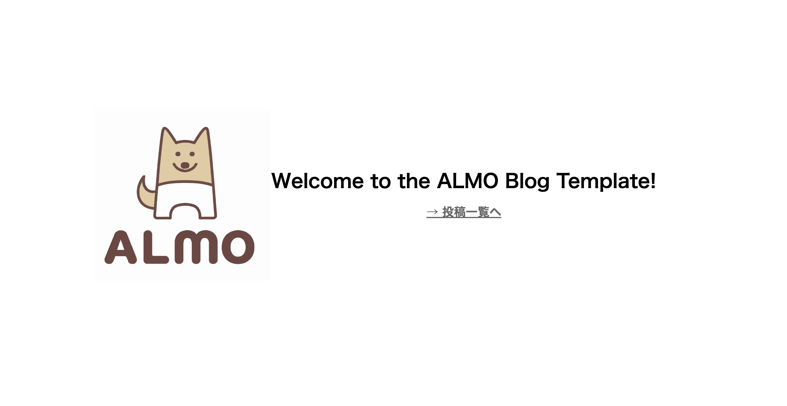

# ALMO-blog

ALMOを使ったブログ作成のテンプレートレポジトリです。


## 使い方

1. `config/config.json` を設定する。

```
{
  # ページのトップのURL。 https://{ユーザ名}.github.io/{レポジトリの名前} になります。
  "root_url": "https://abap34.github.io/ALMO-blog-template",
  # 著者名
  "author": "abap34",
  # 著者のメールアドレス
  "mail": "abap0002@gmail.com",
  # 著者のTwitter ID
  "twitter_id": "abap34",
  # 著者のGitHub ID
  "github_id": "abap34",
  # これ以下のものは全て省略可能で、省略した場合 ALMO のデフォルトのものが使われます。
  # 記事全体のテーマを一括で指定。 `light` または `dark`  (ALMOの `-t` 引数と対応)
  "overall_theme": "light",
  # カスタム CSS のパス。 (ALMOの `-c` 引数と対応)
  "custom_css": "themes/modern-light.css",
  # エディタのテーマ。 (ALMOの `-e` 引数と対応)
  "editor_theme": "ace/theme/xcode",
  # シンタックスハイライトのテーマ。 (ALMOの `-s` 引数と対応)
  "syntax_theme": "github.min"
}
```

2. `generate.py` で記事のテンプレートを作成する。

`python generate.py my-article.md`

3. `posts-md/my-article.md` を編集する。

4. `main` ブランチにプッシュする。


以下のようなページが表示されたら成功です。

このページ自体は `index.html` を編集することでカスタマイズ可能です。

